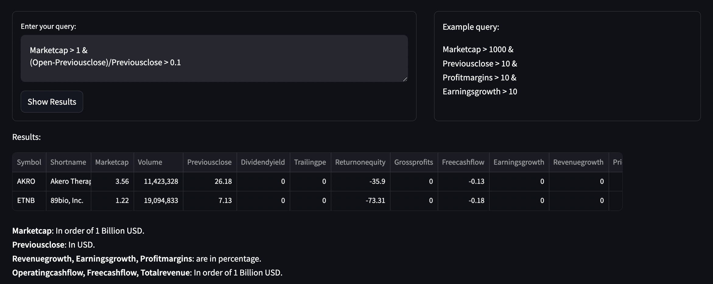
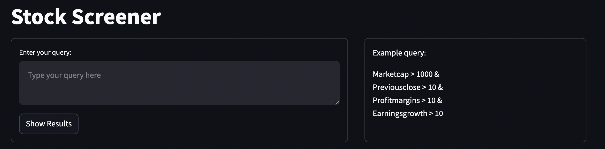
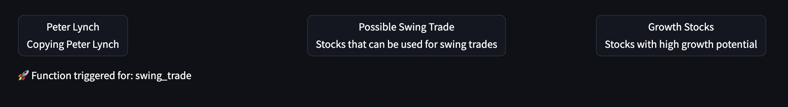

                                       Stock Screener application

---
# Application overview

Stocks are listed from NASDAQ exchange. You can filter stocks based on queries like - 

Marketcap > 1000 &  
Previousclose > 10 &  
Profitmargins > 10 &  
Earningsgrowth > 10

Or even complex queries like -  
Marketcap > 1 &  
Forwardpe < 35 &  
Earningsgrowth > 15 &  
Profitmargins > 10  &  
Returnonequity > 15 &  
Debttoequity < 2



---

### **Application Screenshot**  


You can even filter based on the ideas of famous investors.
> ⚠️ **Note: These filters I have researched and written on my own so, it may or may not work on every stock. But most of the time they have worked.**  



### **Units of Metrics**  
> ⚠️ **Be careful of the units in which all the metrics are used.**  

| Metric                 | Unit |
|------------------------|------------------|
| **Marketcap**         | In order of 1 Billion USD |
| **Previousclose**     | In USD |
| **Revenuegrowth, Earningsgrowth, Profitmargins** | Percentage (%) |
| **Operatingcashflow, Freecashflow, Totalrevenue** | In order of 1 Billion USD |

---

# **Installation**  
1. Clone the repository:  
   ```sh
   git clone https://github.com/AmishKakka/stockscreener
2. You can either run the application using Docker or by creating a virtual environment and then running it -
   ```sh
   docker build -t stockscreener .
   docker run -p 8501:8501 stockscreener
This requires having Docker installed on your system.

   Another way is to create a virtual environment, activate it and then run pip to install libraries.
   ```sh
   python3 -m venv env_name
   source env_name/bin/activate
   pip install -r requirements.txt
   streamlit run main.py
 